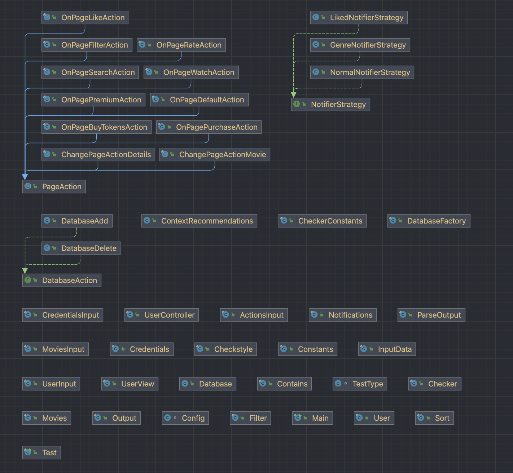
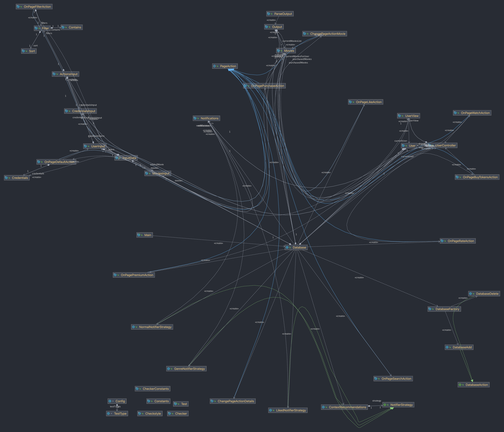

# POO-TV: OOP Project
## Copyright:  Dobrica Nicoleta-Adriana 321CA

## Description:
 - This project implements the backend of a website that allows the user to watch movies.
 - The entire structure of this project revolves around the main database: that's the entry point of the program and where the entire input gets processed.
 - This database holds certain information: the current page, the previous page, information about the users and the movies available; it also provides an "interface" for the current user to do certain actions, while they navigate between each page: logging in, searching a specific movie, watching it etc.

## Implementation:

### UML Diagrams:

### Actions package:

- Contains all the possible actions that a user can do while navigating the website;
- Each of these actions inherit the PageAction class;
- There are 2 different types of actions: **change page action** and **on page action**.
- The **change page** action allows the user to navigate freely between the possible pages of the website, making it possible to see a list of all the possible movies available to them, or see details about a specific one.
- The **on page** allows more flexibility to the user. Depending on what page they are on, a user can request multiple things: if they are on the **upgrades** page, they can buy more tokens to watch movies, or they can upgrade to a premium user. The actions regarding a movie allows the user to have a list of their watched, purchased, liked or rated movies.
- When a user wants to filter the movies, the list that has all the possible movies for the user gets updated according to the user's filters: they can either sort the movies by their durations or ratings, or they can see movies with specific genres or actors.
- All of these actions are completed successfully only if they are valid, and the output will contain a list of the user's current movies and information about the current user. Otherwise, an error message will appear.

### Input package:

- To have a functional database, this input package stores all the input needed to parse the information. 
- The main input contains a list of the users registered on the page, a list of movies and a list of the actions performed by the user.
- The users have their own credentials; the movies contain all the possible information about them and the actions can either be **on page** or **change page**.

### Database package:

- The most important part of the program, the database is where all the information gets processed then printed. 
- After checking if a certain action is valid, the database prints the output according to each action. The current page and the previous page help to move between the pages more easily, and also help for checking invalid actions.
- Another important database consists of the movie database, which contains all the possible available movies on the website. There are two possible actions which can change this movie database: either adding a new movie, or deleting one from it. For this, the Factory design pattern was used because it provided a simplified way of differentiating between two different actions that impact the database.

### Movies package:

- This class is similar to the MoviesInput class, but contains extra information that will be added/processed later when the user is navigating the pages. 

### Output package:

- The Output class offers a template for the two possible types of outputs. Each output will have an error message, a list of the current movies, and information about the user.
- The ParseOutput class implements the template given by the Output class and divides it clearly into two: the normal output, which prints valid information, or the error output, which will contain an error string, an empty list and a null user.
- As we only need one instance of the ParseOutput class at any given time, this class was implemented with a synchronized Singleton pattern, which only returns a unique instance of said class.

### User package:

- Each possible user has their own credentials (e.g. username or a password). As the user navigates the website, extra information is needed to be updated all the time: their balance or their list of purchased, rated, or liked movies.
- For the implementation of the User, UserView and UserController classes, the MVC design pattern was used. This separates the user into three different components. As for this application, we only need a model of the user, and only contains the user's data. UserView presents the desired data by printing certain information, and UserController is the main class where the user data gets processed.

### Recommendations package:

- Used the Strategy design pattern for these classes. When a user is subscribed, they will be sent different types of notifications, hence why a context object (`ContextRecommendations`) was needed.
- `NormalNotifierStrategy` class sends notifications if there is no recommendations available to the current user.
- `GenreNotifierStrategy` sends notifications based on the user's subscribed genre, and `LikedNotifierStrategy` sends notificatoins based on the user's most liked movies.

### UML Diagram with all classes and packages:

### UML Diagram with dependencies:

## OOP aspects implemented:

- As the above diagram shows, all of these classes have strong dependencies. 
- Created abstract classes to make inheritance easier. All of these classes inherit the same class, PageAction.
- Implemented a `synchronized` Singleton pattern for the output because only one instance of this class is needed.
- Implemented the MVC pattern for the user to better differentiate between what represents the model data, what needs to be the output, and what needs to be processed. This also simplifies the user interface and the controlling logic behind it.
- Used Factory design pattern for the actions that are database-related: either adding a new movie to the current database, or deleting it. I chose Factory for this purpose because it provides an efficient way of creating an object without exposing the logic behind it to the client (in our case, the user).
- Used Strategy design pattern for the recommendations. When a user is subscribed, they will have certain types of notifications that will be sent to them, depending on the context in which they have subscribed or not. Because of the importance of the "context", this design pattern was used because the structure of the notifications vary.